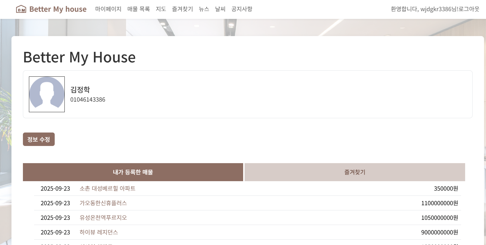
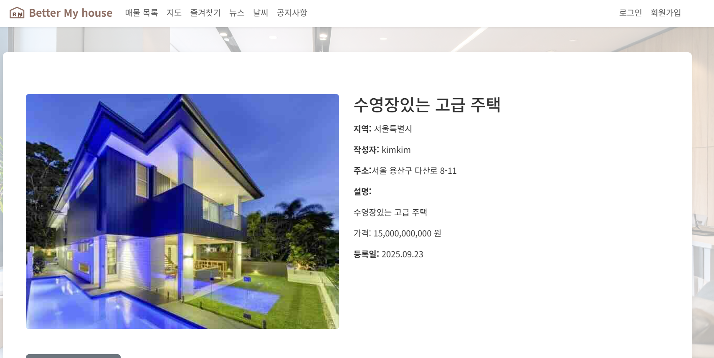
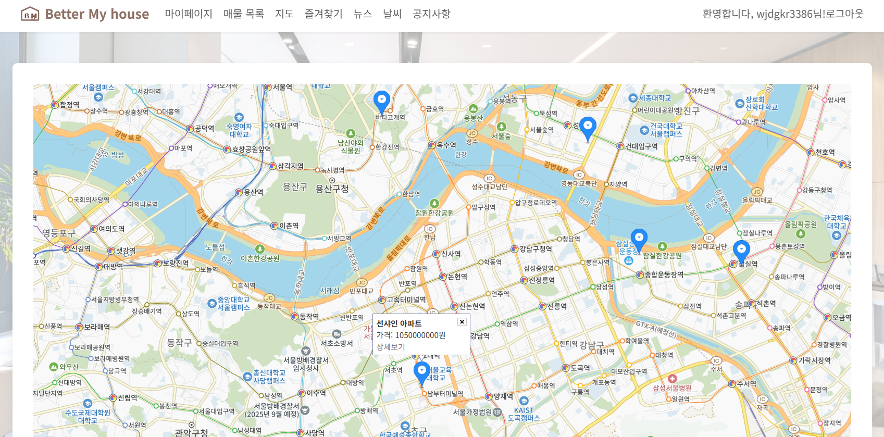
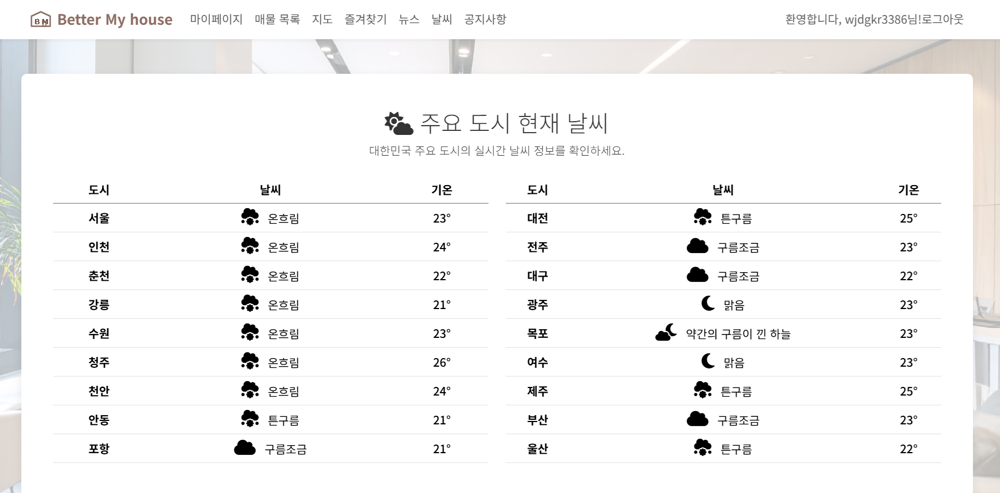
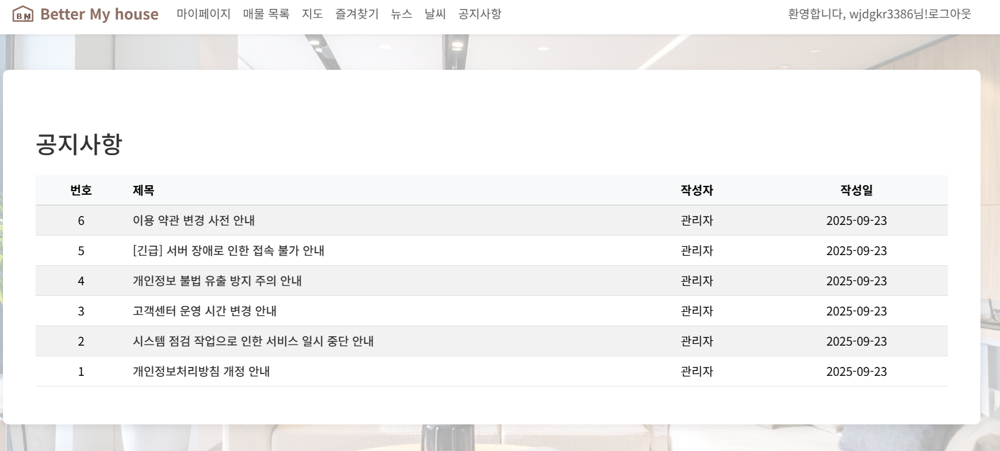

## 부동산 한눈에 보기
부동산 매물 관리 사이트

## 팀장 : 이민규
- 김기원, 김승식, 김태관, 김정학

## 기술 스택
- 프레임워크: Django
- 언어: Python, JavaScript, HTML, CSS
- DB: MySQL, SQLite3(개발)
- 라이브러리: Bootstrap
- 도구/개발환경: PyCham, Git/GitHub
- API: 날씨(OpenWeather), 지도(Kakao Maps), 뉴스(News API), 지오코딩

## 💡 주요 기능
1. 매물 등록: 매물의 이름, 주소, 가격 등 데이터를 받아 저장합니다
2. 매물 목록: 등록된 매물을 꺼내 리스트에 보여주거나 지도에 마커를 찍어 보여줍니다

## 📸 프로젝트 화면

## 설치 코드 (가상환경에서)
pip install -r requirements.txt  
python manage.py makemigrations  
python manage.py migrate  
## 실행 코드 (가상환경에서)
python manage.py runserver